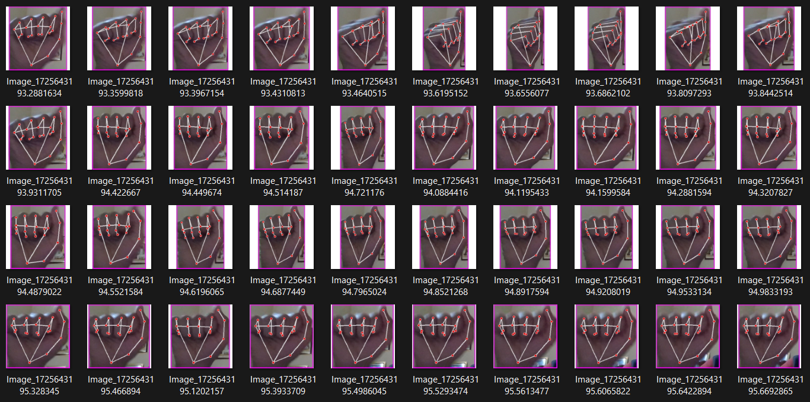
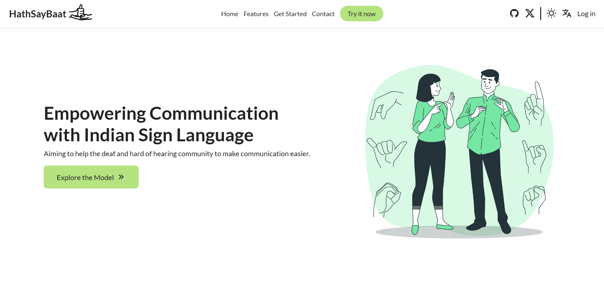
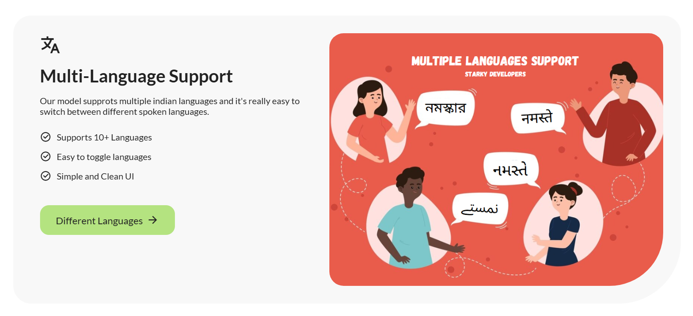

## Indian Sign Language to text and speech conversion

HathSayBaat is a tool which helps the deaf and the hard-of-hearing community to translate their sign language into text and speech forms. It'll allow then to communicate better and removes the barrier to know sign language to understand and talk to the deaf and hard-of-hearing community.

### TODO - tasks to do for the project - For PROTOTYPE

_Starting Setup_

- [ ] Install necessary libraries
- [ ] Make a github Repo

_Model_

- [ ] Setup the environment
- [ ] Making program to collect and preprocess data
- [ ] Creation of dataset

_Website_

- [ ] Design a website
- [ ] Collecting the relevant images, videos & icons
- [ ] Making the structure of the website

- [ ] Adding styles to the website
- [ ] Adding dark-mode and scroll-up feature
- [ ] Link to model page and style it
- [ ] Add Social links like github and X (formerly twitter)
- [ ] Integrate the model to website

